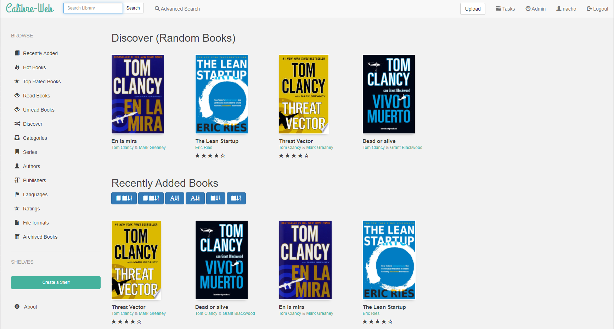

# Calibre Web

This recipe deploy several resources that includes a deployment, service, and IngressRoute. You need to create two folders, one where the configuration is going to be saved, and the books itself.

```
$ mkdir -p /mnt/data/calibre-web-data/config
```
```
$ mkdir -p /mnt/data/calibre-web-data/books
```

Once folders were created, you need to modify the IngressRoute with your address, after that, you're ready to deploy Calibre Web:

```
$ kubectl apply -f calibre-web.yml
```

## Screenshot


