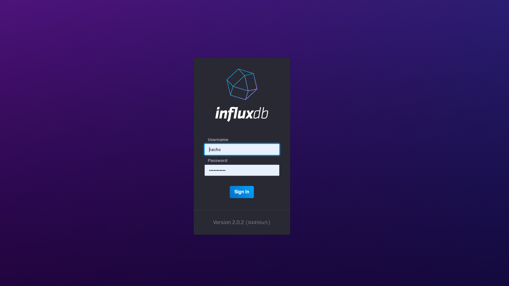

# InfluxDB OSS v2.0.3

This recipe deploy several resources that includes a deployment, service, and IngressRoute. You need to create one folder where the config and databases will going to be saved. 

```
$ mkdir -p /mnt/data/influxdb
```

Once the folder was created, you need to modify the IngressRoute with your address, after that, you're ready to deploy InfluxDB:

```
$ kubectl apply -f influxdb.yml
```

## Screenshot


