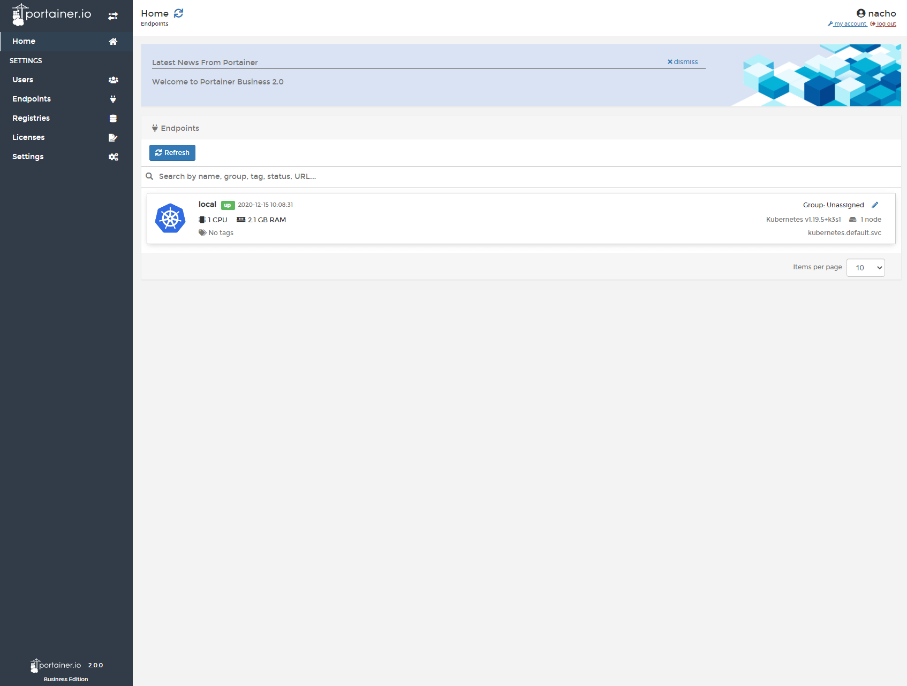

# Portainer Business V2.0

This recipe deploy Portainer Business V2.0 deploy in the default namespace services, deployment and two IngressRoute, one for Frontend and other for Edge.

To deploy this recipe, first, you need to create a folder to mount the configuration of Portainer.

```
$ mkdir -p /mnt/data/portainer
```

Once the folder is created, you can deploy the recipe:

```
$ kubectl apply -f portainer-lb-ee.yml
```

## Screenshot


