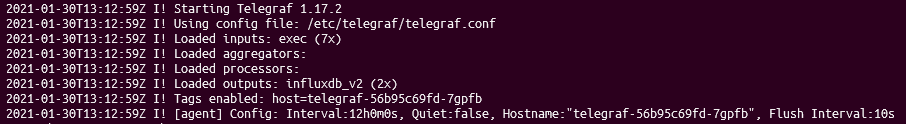

# Telegraf

This recipe is for run Telegraf. In this case I use hostPath to mount the configuration file.

You need to create this folder or modify the path in the YML file.

```
$ mkdir -p /mnt/data/telegraf/
```

Once the folder and configuration file is created, you need to run the following:
```
$ kubectl apply -f telegraf.yml
```

## Screenshot


